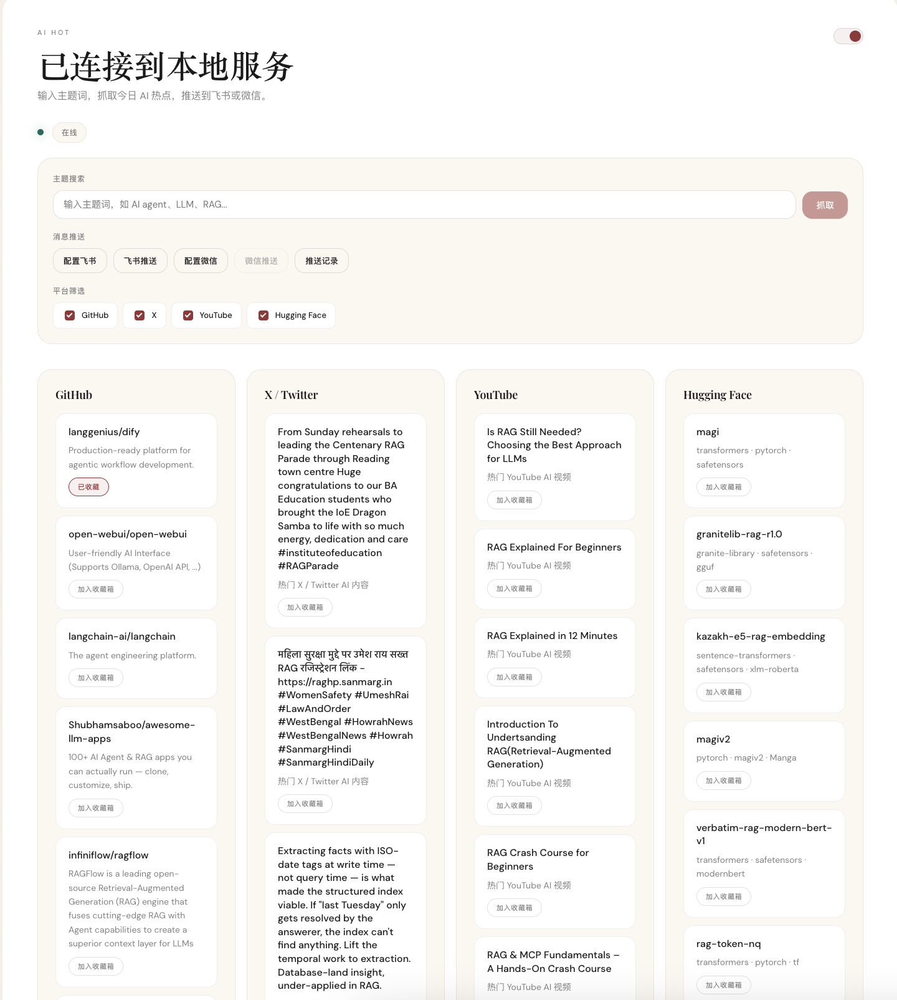
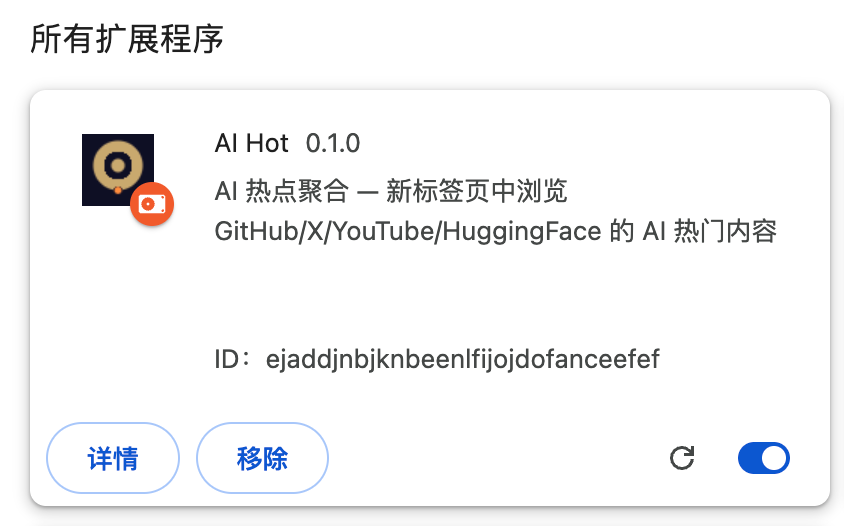
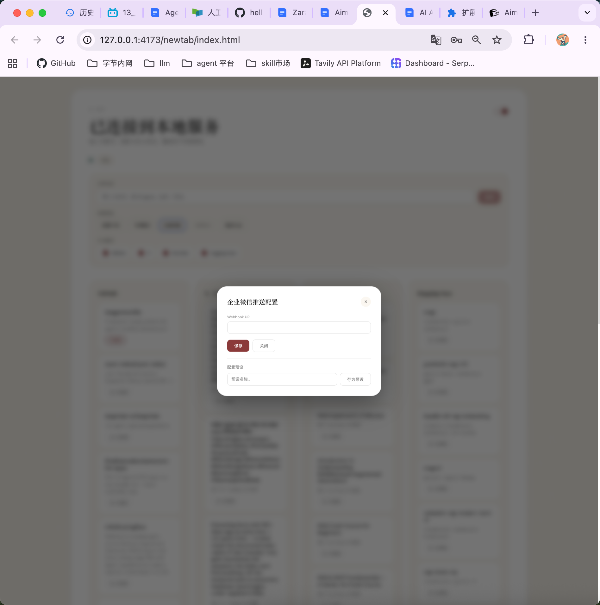

# AI Hot

AI 热点聚合浏览器扩展 — 在新标签页中浏览 GitHub、X、YouTube、Hugging Face 的 AI 热门内容，支持一键推送到飞书和企业微信。

<p align="center">
  
</p>

## 功能特性

- **多平台聚合** — 从 GitHub、X/Twitter、YouTube、Hugging Face 四个平台抓取 AI 热门内容
- **主题搜索** — 输入自定义主题词（如 "RAG"、"LLM Agent"），精准抓取相关内容
- **响应式卡片布局** — 根据浏览器宽度自动适应 1-4 列，完美适配不同屏幕尺寸
- **深色/浅色模式** — 两套主题，一键切换
- **飞书推送** — 配置飞书开放平台应用，将今日热点推送到飞书会话
- **企业微信推送** — 配置企业微信机器人 Webhook，推送到群聊
- **推送记录** — 查看历史推送记录，支持多次推送
- **Chrome 新标签页** — 替换浏览器默认新标签页，每次打开都是 AI 资讯看板

## 截图

<table>
  <tr>
    <td width="50%"></td>
    <td width="50%"></td>
  </tr>
  <tr>
    <td align="center">Chrome 扩展管理</td>
    <td align="center">飞书消息推送效果</td>
  </tr>
</table>

<table>
  <tr>
    <td width="33%"></td>
    <td width="33%"></td>
    <td width="33%"></td>
  </tr>
  <tr>
    <td align="center">飞书推送配置</td>
    <td align="center">企业微信推送配置</td>
    <td align="center">推送记录</td>
  </tr>
</table>

## 架构

```
┌─────────────────────────────────────────────────┐
│              Chrome Extension (newtab)            │
│          React + Vite + CSS Variables            │
│              127.0.0.1:4173                      │
└────────────────────┬────────────────────────────┘
                     │ HTTP API
┌────────────────────▼────────────────────────────┐
│           Companion Service (Express)             │
│              127.0.0.1:4317                      │
│                                                   │
│  ┌──────────┐  ┌──────────┐  ┌───────────────┐  │
│  │  GitHub   │  │HuggingFace│  │ Browser Tier  │  │
│  │ REST API  │  │ REST API  │  │ (CDP → API →  │  │
│  │ (public)  │  │ (public)  │  │     HTML)     │  │
│  └──────────┘  └──────────┘  │  X / YouTube / │  │
│                               │  Xiaohongshu   │  │
│                               └───────────────┘  │
│                                                   │
│  ┌─────────────────────────────────────────────┐ │
│  │           SQLite (better-sqlite3)            │ │
│  │   feed_items / cookies / push_records / …   │ │
│  └─────────────────────────────────────────────┘ │
└─────────────────────────────────────────────────┘
```

### 数据采集流程

- **GitHub / Hugging Face** — 直接调用公开 REST API，无需认证
- **X / YouTube / 小红书** — 通过 CDP 协议连接本地 Chrome 浏览器，利用浏览器的登录态进行数据采集。三级降级策略：CDP 网络拦截 → API 适配器 → HTML 适配器

## 技术栈

| 模块 | 技术 |
|------|------|
| Chrome 扩展 | React 19、TypeScript、Vite 7 |
| 后端服务 | Express、better-sqlite3、Playwright |
| 共享类型 | Zod schema、TypeScript |
| 测试 | Vitest、Playwright (E2E) |
| 包管理 | pnpm 10 (monorepo) |

## 快速开始

### 环境要求

- **Node.js** >= 18
- **pnpm** >= 10
- **Chrome 浏览器**（用于 X/YouTube/小红书数据采集）
- **macOS**（Chrome Profile 自动发现依赖 macOS 特性）

### 1. 安装依赖

```bash
pnpm install
```

### 2. 启动后端服务

```bash
pnpm start:companion-service
```

服务运行在 `http://127.0.0.1:4317`。

### 3. 构建 Chrome 扩展

```bash
cd apps/chrome-extension
pnpm build
```

### 4. 加载扩展

1. 打开 Chrome，访问 `chrome://extensions`
2. 开启"开发者模式"
3. 点击"加载已解压的扩展程序"
4. 选择 `apps/chrome-extension/dist` 目录

### 5. 开发模式

```bash
# 启动前端开发服务器
cd apps/chrome-extension && npx vite --host 127.0.0.1 --port 4173

# 在浏览器中预览
open http://127.0.0.1:4173/newtab/index.html
```

## 项目结构

```
ai-hot/
├── apps/
│   ├── chrome-extension/    # Chrome 扩展（新标签页）
│   │   ├── src/
│   │   │   ├── newtab/      # 新标签页 UI
│   │   │   ├── options/     # 扩展选项页
│   │   │   ├── manifest.json
│   │   │   └── icons/
│   │   └── dist/            # 构建输出（加载到 Chrome）
│   └── companion-service/   # 后端 API 服务
│       └── src/
│           ├── adapters/    # 平台适配器（GitHub/X/YouTube/...）
│           ├── browser/     # CDP 浏览器会话管理
│           ├── db/          # 数据库层（SQLite）
│           ├── feed/        # 采集与排名逻辑
│           ├── scheduler/   # 定时任务
│           └── server/      # Express API 路由
├── packages/
│   └── shared/              # 共享类型与常量
├── scripts/                 # 运行脚本（每日更新、调试等）
├── tests/                   # 测试用例
└── docs/
    └── screenshots/         # 项目截图
```

## 常用命令

```bash
pnpm test              # 运行所有测试
pnpm typecheck         # TypeScript 类型检查
pnpm lint              # ESLint 检查
pnpm run:daily-update  # 手动执行每日更新
```

## License

MIT