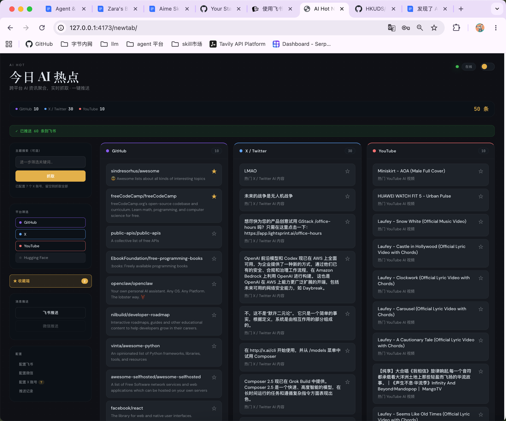
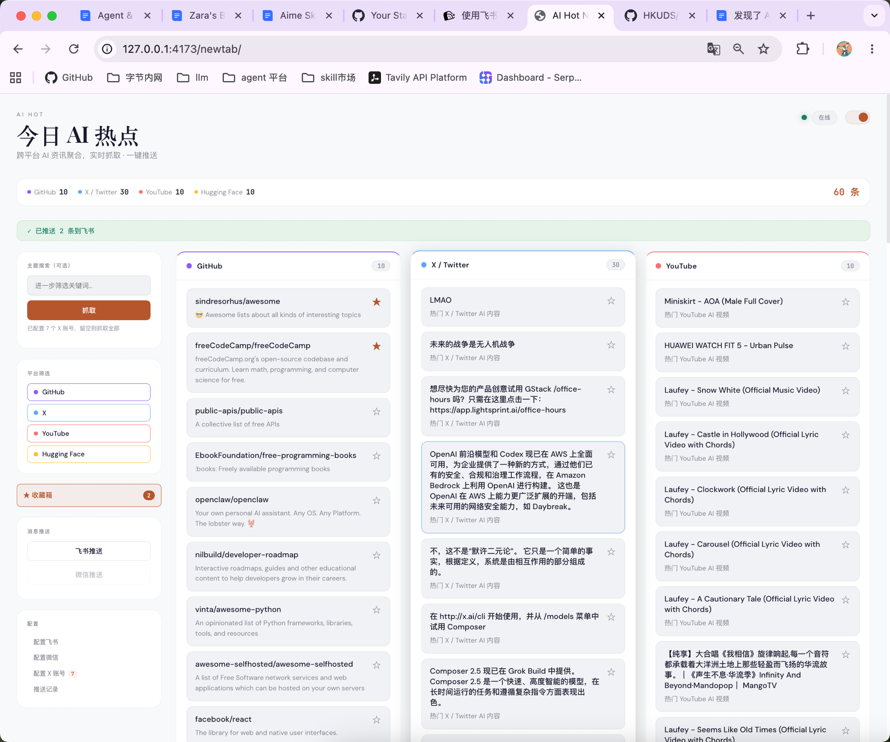
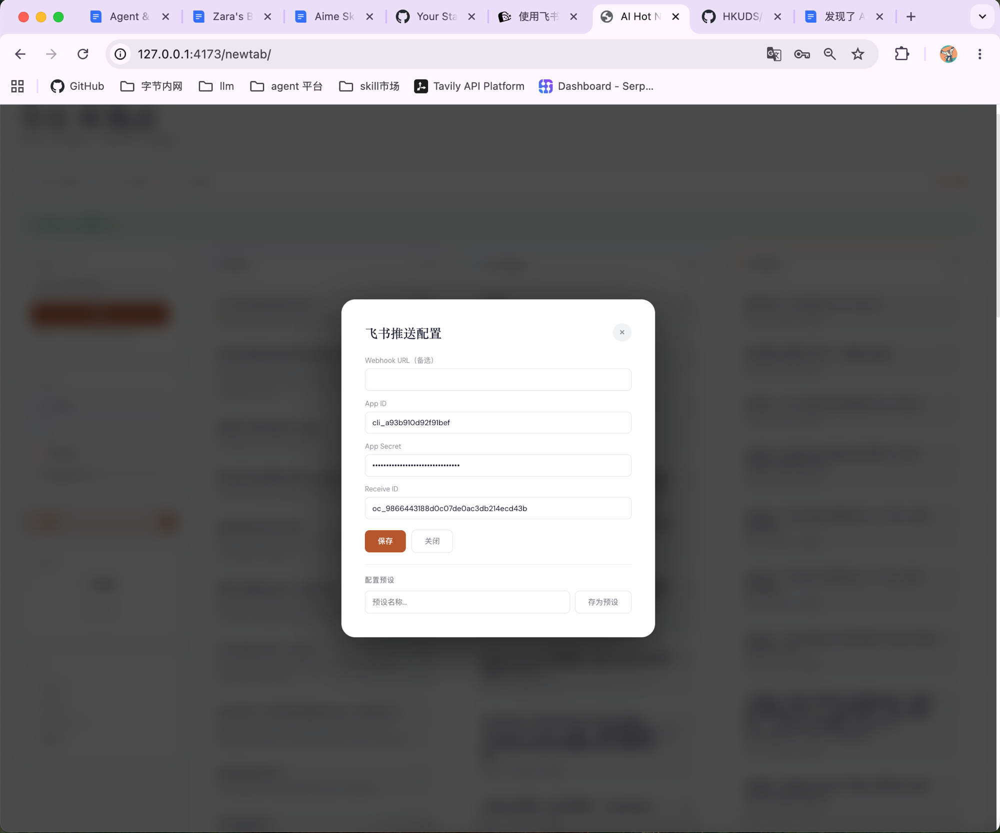
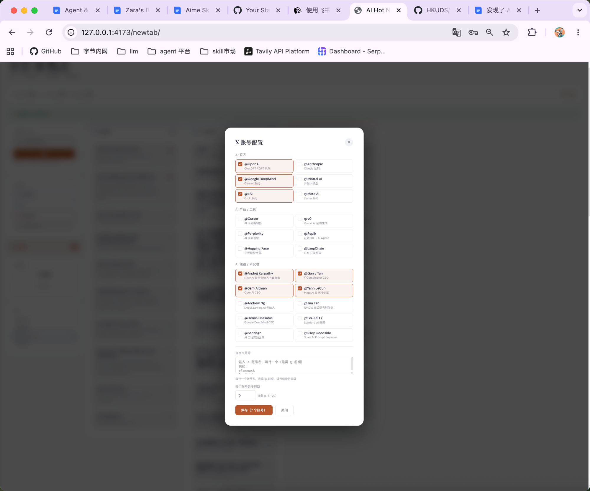
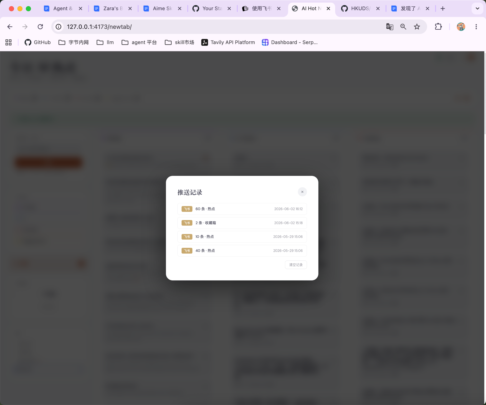
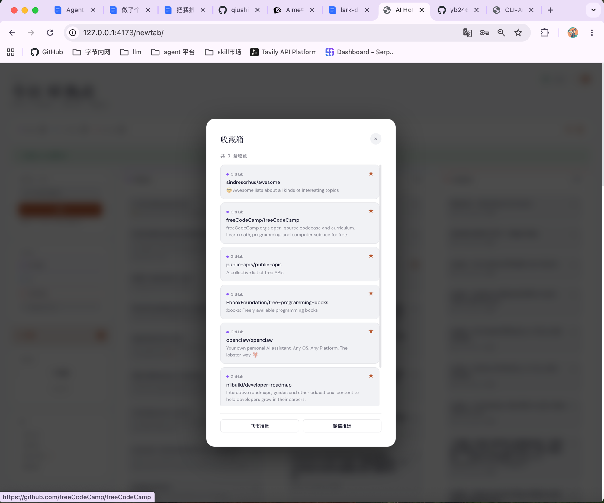

# AI Hot

AI 热点聚合浏览器扩展 — 在新标签页中浏览 GitHub、X、YouTube、Hugging Face 的 AI 热门内容，支持一键推送到飞书和企业微信。

<p align="center">
  
</p>

## 功能特性

- **多平台聚合** — 从 GitHub、X/Twitter、YouTube、Hugging Face 四个平台抓取 AI 热门内容
- **主题搜索** — 输入自定义主题词（如 "RAG"、"LLM Agent"），精准抓取相关内容
- **X 账号追踪** — 支持配置 X 平台追踪账号（AI 公司、产品、领袖），按账号抓取最新动态
- **Observatory 深色主题** — 深空观测台风格仪表盘，平台色彩识别，含浅色/深色双模式
- **收藏与推送** — 收藏感兴趣的内容到收藏箱，支持从收藏箱一键推送
- **飞书推送** — 配置飞书开放平台应用或 Webhook，将今日热点推送到飞书会话
- **企业微信推送** — 配置企业微信机器人 Webhook，推送到群聊
- **推送记录** — 查看历史推送记录，支持清空和多次推送
- **Chrome 新标签页** — 替换浏览器默认新标签页，每次打开都是 AI 资讯看板

## 截图

### 仪表盘

<table>
  <tr>
    <td width="50%"></td>
    <td width="50%"></td>
  </tr>
  <tr>
    <td align="center">深色模式 — Observatory 观测台风格</td>
    <td align="center">浅色模式</td>
  </tr>
</table>

### 配置与推送

<table>
  <tr>
    <td width="50%"></td>
    <td width="50%"></td>
  </tr>
  <tr>
    <td align="center">飞书推送配置</td>
    <td align="center">X 账号配置</td>
  </tr>
</table>

### 推送记录

<p align="center">
  
</p>

### 收藏箱

<p align="center">
  
</p>

## 快速安装

### 方式一：下载 Release（推荐）

1. 在 [Releases](https://github.com/qiushibang/ai-hot/releases) 页面下载最新版 `ai-hot-v0.1.0.zip`
2. 解压到任意目录（如 `~/ai-hot-extension/`）
3. 打开 Chrome 浏览器，访问 `chrome://extensions`
4. 开启右上角「**开发者模式**」
5. 点击「**加载已解压的扩展程序**」
6. 选择刚才解压的文件夹
7. 克隆仓库并启动后端服务（见下方"启动后端服务"）

### 方式二：从源码构建

需要先安装 **Node.js >= 18** 和 **pnpm >= 10**：

```bash
# 克隆仓库
git clone https://github.com/qiushibang/ai-hot.git
cd ai-hot

# 安装依赖
pnpm install

# 构建扩展
cd apps/chrome-extension
pnpm build
```

构建完成后，将 `apps/chrome-extension/dist` 目录加载到 Chrome 扩展中（步骤同方式一）。

## 启动后端服务

> **重要**：扩展需要本地后端服务才能工作，每次使用前需要启动。服务运行在 `http://127.0.0.1:4317`。

```bash
cd ai-hot
pnpm start:companion-service
```

启动后终端保持打开即可。如果关闭终端，服务也会停止，需要重新启动。

### 开机自启（可选）

macOS 用户可以将服务设为登录项：

```bash
# 创建 LaunchAgent 配置文件
mkdir -p ~/Library/LaunchAgents
cat > ~/Library/LaunchAgents/com.ai-hot.companion.plist << 'EOF'
<?xml version="1.0" encoding="UTF-8"?>
<!DOCTYPE plist PUBLIC "-//Apple//DTD PLIST 1.0//EN"
  "http://www.apple.com/DTDs/PropertyList-1.0.dtd">
<plist version="1.0">
<dict>
    <key>Label</key>
    <string>com.ai-hot.companion</string>
    <key>ProgramArguments</key>
    <array>
        <string>/path/to/ai-hot/scripts/start-companion.sh</string>
    </array>
    <key>RunAtLoad</key>
    <true/>
    <key>KeepAlive</key>
    <true/>
</dict>
</plist>
EOF

# 加载服务
launchctl load ~/Library/LaunchAgents/com.ai-hot.companion.plist
```

> 请将 `/path/to/ai-hot` 替换为你的实际项目路径。

## 使用说明

### 搜索主题

1. 在侧边栏搜索框中输入主题词，如 `RAG`、`LLM Agent`、`OpenAI`
2. 点击「**抓取**」按钮
3. 等待数据采集完成（X/YouTube 等平台需要已登录 Chrome）

### 配置推送

#### 飞书推送

支持两种方式：

| 方式 | 说明 | 需要配置 |
|------|------|---------|
| Webhook | 配置飞书群机器人 Webhook 地址 | Webhook URL |
| 开放平台 API | 通过飞书开放平台应用发送消息 | App ID、App Secret、Receive ID |

在设置页（右键扩展图标 → 选项）或仪表盘侧边栏的飞书配置按钮中填写。

#### 企业微信推送

1. 在企业微信管理后台创建群机器人
2. 复制 Webhook 地址
3. 在设置页中填入 Webhook URL

### X 账号追踪

1. 点击侧边栏「**X 账号配置**」按钮
2. 选择预设账号或手动输入要追踪的 X 账号（如 `@OpenAI`、`@GoogleDeepMind`）
3. 设置每个账号最大抓取条数（1-20）
4. 抓取时会按账号分别获取最新内容

### 收藏与推送

- 点击卡片右上角的 ⭐ 按钮收藏内容
- 点击侧边栏「**收藏箱**」查看已收藏内容
- 在收藏箱中可选择推送到飞书或企业微信

## 常见问题

### Q: 打开新标签页显示"服务离线"？

A: 请确保后端服务已启动，在终端中运行：

```bash
cd ai-hot && pnpm start:companion-service
```

### Q: X/YouTube 平台显示"无数据"或"未登录"？

A: 这两个平台需要通过 Chrome 浏览器的登录态采集数据。请确保：
1. Chrome 浏览器正在运行
2. 已在 Chrome 中登录 X 和 YouTube
3. 后端服务已启动

### Q: 支持 Windows 或 Linux 吗？

A: 扩展本身跨平台。后端服务支持 macOS、Linux、Windows，只要系统安装了 Chrome 浏览器和 Node.js。

### Q: 端口 4317 被占用怎么办？

A: 可以通过环境变量修改端口：

```bash
COMPANION_SERVICE_PORT=4318 pnpm start:companion-service
```

然后修改扩展的 `host_permissions` 以匹配新端口。

### Q: 如何更新扩展？

A: 下载最新 Release ZIP，解压到相同目录覆盖即可。Chrome 会自动识别更新。

## 架构

```
┌─────────────────────────────────────────────────┐
│              Chrome Extension (newtab)            │
│          React + Vite + CSS Variables            │
│              127.0.0.1:4173                      │
└────────────────────┬────────────────────────────┘
                     │ HTTP API
┌────────────────────▼────────────────────────────┐
│           Companion Service (Express)             │
│              127.0.0.1:4317                      │
│                                                   │
│  ┌──────────┐  ┌──────────┐  ┌───────────────┐  │
│  │  GitHub   │  │HuggingFace│  │ Browser Tier  │  │
│  │ REST API  │  │ REST API  │  │ (CDP → API →  │  │
│  │ (public)  │  │ (public)  │  │     HTML)     │  │
│  └──────────┘  └──────────┘  │  X / YouTube /  │  │
│                               │  Xiaohongshu   │  │
│                               └───────────────┘  │
│                                                   │
│  ┌─────────────────────────────────────────────┐ │
│  │           SQLite (better-sqlite3)            │ │
│  │   feed_items / cookies / favorites /        │ │
│  │   settings / …                              │ │
│  └─────────────────────────────────────────────┘ │
└─────────────────────────────────────────────────┘
```

### 数据采集流程

- **GitHub / Hugging Face** — 直接调用公开 REST API，无需认证
- **X / YouTube / 小红书** — 通过 CDP 协议连接本地 Chrome 浏览器，利用浏览器的登录态进行数据采集。三级降级策略：CDP 网络拦截 → API 适配器 → HTML 适配器

## 技术栈

| 模块 | 技术 |
|------|------|
| Chrome 扩展 | React 19、TypeScript、Vite 7 |
| 后端服务 | Express、better-sqlite3、Playwright |
| 共享类型 | Zod schema、TypeScript |
| 测试 | Vitest、Playwright (E2E) |
| 包管理 | pnpm 10 (monorepo) |

## 项目结构

```
ai-hot/
├── apps/
│   ├── chrome-extension/    # Chrome 扩展（新标签页）
│   │   ├── src/
│   │   │   ├── newtab/      # 新标签页 UI
│   │   │   ├── options/     # 扩展选项页
│   │   │   ├── manifest.json
│   │   │   └── icons/
│   │   └── dist/            # 构建输出（加载到 Chrome）
│   └── companion-service/   # 后端 API 服务
│       └── src/
│           ├── adapters/    # 平台适配器（GitHub/X/YouTube/...）
│           ├── browser/     # CDP 浏览器会话管理
│           ├── db/          # 数据库层（SQLite）
│           ├── feed/        # 采集与排名逻辑
│           ├── scheduler/   # 定时任务
│           └── server/      # Express API 路由
├── packages/
│   └── shared/              # 共享类型与常量
├── scripts/                 # 运行脚本（每日更新、调试等）
├── tests/                   # 测试用例
└── docs/
    └── screenshots/         # 项目截图
```

## 开发

```bash
# 安装依赖
pnpm install

# 启动后端服务（开发模式，自动重启）
pnpm start:companion-service

# 启动前端开发服务器
cd apps/chrome-extension && npx vite --host 127.0.0.1 --port 4173

# 在浏览器中预览新标签页
open http://127.0.0.1:4173/newtab/index.html

# 运行测试
pnpm test

# 类型检查
pnpm typecheck

# 代码检查
pnpm lint

# 手动执行每日更新
pnpm run:daily-update
```

## License

MIT © [qiushibang](https://github.com/qiushibang)